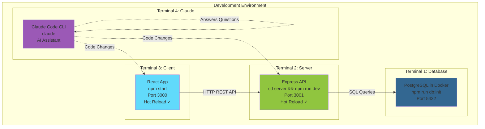

# 🚀 Getting Started Guide

Complete guide to get your React Super App up and running with Docker Compose, PostgreSQL, and REST API.

---

## 📋 Table of Contents

1. [Prerequisites](#-prerequisites)
2. [Quick Start (5 Minutes)](#-quick-start-5-minutes)
3. [Manual Setup (Step-by-Step)](#-manual-setup-step-by-step)
4. [Development Mode (Local, No Docker)](#-development-mode-local-no-docker)
5. [Success Checklist](#-success-checklist)
6. [Service Management](#-service-management)
7. [Troubleshooting](#-troubleshooting)

---

## 📋 Prerequisites

Before you begin, ensure you have the following installed and running:

- **Docker Desktop** (version 20.10 or higher) - [Download here](https://www.docker.com/get-started)
  - **Must be running** before starting services
  - On macOS, our scripts can auto-start Docker Desktop for you
  - Verify Docker is running: `docker info`
  - Verify versions: `docker --version` and `docker compose --version`
- **Git** - For cloning the repository
- **Ports Available**: Ensure ports 3000 (client), 3001 (server), and 5432 (database) are not in use

**Quick Port Check:**
```bash
# After cloning, run this to verify ports are available
npm run check-ports
```

---

## ⚡ Quick Start (5 Minutes)

### Step 1: Clone the Repository

```bash
git clone https://github.com/sbecker11/react-super-app.git
cd react-super-app
```

### Step 2: Configure Environment

Create your `.env` file by copying the example template:

```bash
cp .env.example .env
```

**Important:** The `.env.example` file contains all default configuration:
- Database configuration (PostgreSQL user, password, database name, port)
- Server configuration (port, NODE_ENV, JWT secret and expiration)
- Client configuration (port, API URL, environment)

**⚠️ Security Note**: Change `JWT_SECRET` in production! Generate a strong secret with:
```bash
node -e "console.log(require('crypto').randomBytes(64).toString('hex'))"
```

**Optional Customization**: Edit `.env` to change:
- **`NODE_ENV`**: `development`, `production`, or `test`
- **`REACT_APP_ENV`**: Should match `NODE_ENV`
- **Port numbers**: If defaults (3000, 3001, 5432) conflict with other services

**Note**: The `.env` file is in `.gitignore` and won't be committed to Git.

### Step 3: Initialize the Database

Run the database initialization script:

```bash
npm run db:init
```

**What this does:**
- ✅ Checks if Docker Desktop is running (auto-starts on macOS if needed)
- ✅ Starts PostgreSQL container
- ✅ Creates database and schema
- ✅ Verifies all tables and indexes

**Expected output:**
```
Step 0: Checking Docker...
✓ Docker is running
✓ Using: docker compose
Step 1: Starting PostgreSQL container...
✓ PostgreSQL container started
Step 2: Waiting for PostgreSQL to be ready...
✓ PostgreSQL is ready!
...
Database Initialization Complete!
```

### Step 4: Start All Services

Start all services (client, server, database):

```bash
# Option A: Standard docker compose (recommended)
docker compose up --build

# Option B: Using our helper script with port checking
npm run start:services

# Option C: Run in background (detached mode)
npm run start:services:detached
```

**What happens:**
- ✅ Builds Docker images for all services (first time only)
- ✅ Starts PostgreSQL database container (port 5432)
- ✅ Starts Express REST API server (port 3001)
- ✅ Starts React development client (port 3000)

**Expected output:**
```
postgres_1  | database system is ready to accept connections
server_1    | 🚀 Server running on port 3001
client_1    | Compiled successfully!
client_1    | webpack compiled successfully
```

**Timing:**
- **First run**: 2-5 minutes (building images and installing dependencies)
- **Subsequent runs**: 30-60 seconds (containers start quickly)

### Step 5: Access the Application

- **Client (React App)**: [http://localhost:3000](http://localhost:3000)
- **API (Express Server)**: [http://localhost:3001](http://localhost:3001)
- **API Health Check**: [http://localhost:3001/api/health](http://localhost:3001/api/health)

**🎉 That's it!** The application is now running with all services.

---

## 🔧 Manual Setup (Step-by-Step)

Use this guide when you need more control over the setup process or when troubleshooting.

### When to Use Manual Setup

**Use Manual Setup When:**

1. **Debugging Issues**
   - Need to see each step's output
   - Want to verify each service individually
   - Troubleshooting connection problems

2. **Custom Configuration**
   - Using non-standard ports
   - Running services on different machines
   - Custom environment variables

3. **Development Workflow**
   - Only need database running
   - Want to run server/client separately
   - Testing specific components

4. **Learning/Understanding**
   - Want to understand the setup process
   - Learning Docker and service orchestration
   - Teaching others

### Manual Setup Steps

#### **Step 1: Clean Existing Resources**

```bash
# Stop and remove all containers, networks, and volumes
docker compose down -v

# Remove old images (optional)
docker images | grep -E "react-super-app|react_super_app" | awk '{print $3}' | xargs docker rmi -f 2>/dev/null || true
```

#### **Step 2: Start PostgreSQL**

```bash
# Start only the database service
docker compose up -d postgres

# Wait for database to be ready
sleep 5

# Verify database is running
docker ps | grep postgres
```

#### **Step 3: Run Database Migration**

```bash
# Run the migration to create tables and admin user
npm run db:migrate:001

# Verify migration succeeded
npm run db:shell
\dt  # List tables
SELECT * FROM users WHERE role = 'admin';  # Check admin user
\q
```

#### **Step 4: Start Backend Server**

```bash
# Navigate to server directory
cd server

# Install dependencies (if needed)
npm install

# Start server in background
npm start &

# Save the process ID
echo $! > ../.server.pid

# Wait for server to start
sleep 3

# Verify server is running
curl http://localhost:3001/health

# Return to project root
cd ..
```

#### **Step 5: Start Frontend Client**

```bash
# Install dependencies (if needed)
npm install

# Start React app (will open browser automatically)
npm start
```

#### **Step 6: Open Browser**

```bash
# macOS
open http://localhost:3000

# Linux
xdg-open http://localhost:3000

# Windows (WSL)
explorer.exe http://localhost:3000
```

---

## 💻 Development Mode (Local, No Docker)

If you prefer to run client and server locally (outside Docker) for faster development:

### Daily Development (4 Terminals)

For the best development experience, use 4 terminals:



**Setup Flow**:
- **Terminal 1** stays running (database is persistent)
- **Terminal 2 & 3** have hot reload (changes auto-refresh)
- **Terminal 4** is interactive (ask questions, make changes)

#### Terminal 1: Database
```bash
npm run db:init
# Database runs in Docker, persistent
# Only needs to be started once
```

#### Terminal 2: Server
```bash
cd server
npm install  # First time only
npm run dev
# Server runs on http://localhost:3001
# Hot reload enabled via nodemon
```

#### Terminal 3: Client
```bash
npm install  # First time only
npm start
# Client runs on http://localhost:3000 (opens automatically)
# Hot reload enabled via webpack dev server
```

#### Terminal 4: Claude Code
```bash
claude
# Interactive AI assistant for:
# - Answering questions about the codebase
# - Making code changes
# - Running tests
# - Debugging issues
# - Generating documentation
```

### Advantages of 4-Terminal Development
- **Faster hot reload** - Changes reflect immediately in server/client
- **Easier debugging** - Direct access to console logs in each terminal
- **Better IDE integration** - Breakpoints and debugging tools work better
- **No Docker overhead** - Faster startup and less resource usage
- **AI assistance** - Claude Code available for instant help
- **Independent restarts** - Restart server or client without affecting others

### Typical Workflow

1. **Start all terminals** (once per day)
   - Terminal 1: `npm run db:init`
   - Terminal 2: `cd server && npm run dev`
   - Terminal 3: `npm start`
   - Terminal 4: `claude`

2. **Make changes** in your IDE
   - Server changes: Auto-reload in Terminal 2
   - Client changes: Auto-reload in Terminal 3
   - Ask Claude for help in Terminal 4

3. **Test changes**
   - Run tests via Claude: "run the tests"
   - Or manually: `npm test` (client), `cd server && npm test` (server)

4. **Commit changes**
   - Ask Claude: "commit these changes with a good message"
   - Or manually: `git add . && git commit -m "message"`

### Notes
- Database still runs in Docker (via `npm run db:init`)
- Environment variables from `.env` are still used
- API URL should be configured in `.env` as `REACT_APP_API_URL=http://localhost:3001/api`
- Only database needs Docker; server and client run natively for better performance

---

## ✅ Success Checklist

After starting Docker Compose, verify everything is working:

### 1. Check Containers Are Running
```bash
docker compose ps
```
**Expected:** All containers show "Up" status

### 2. Test API Health Endpoint
```bash
curl http://localhost:3001/health
```
**Expected result:**
```json
{"status":"ok","message":"Server is running"}
```

### 3. Test API Registration
```bash
curl -X POST http://localhost:3001/api/auth/register \
  -H "Content-Type: application/json" \
  -d '{"name":"Test User","email":"test@example.com","password":"TestPass123!"}'
```
**Expected result:** Returns token and user data

### 4. Open Browser to React App
```bash
open http://localhost:3000  # macOS
# OR
xdg-open http://localhost:3000  # Linux
```
**Expected:** React app loads in browser

### Verification Checklist
- [ ] PostgreSQL container is running
- [ ] Server responds to `/health` endpoint
- [ ] You can register a user via API (returns token)
- [ ] You can login via API (returns token)
- [ ] React app loads at http://localhost:3000
- [ ] No errors in Docker Compose logs

---

## 🎛️ Service Management

### Individual Service Management

#### **Database Only**

```bash
# Start
docker compose up -d postgres

# Stop
docker compose stop postgres

# Restart
docker compose restart postgres

# View logs
docker compose logs -f postgres

# Connect to shell
npm run db:shell
```

#### **Backend Server Only**

```bash
# Start (foreground)
cd server && npm start

# Start (background)
cd server && npm start > ../server.log 2>&1 &

# Stop (if running in background)
kill $(cat .server.pid)

# View logs
tail -f server.log
```

#### **Frontend Client Only**

```bash
# Start (foreground)
npm start

# Start (background)
BROWSER=none npm start > client.log 2>&1 &

# Stop (if running in background)
kill $(cat .client.pid)

# View logs
tail -f client.log
```

### Service Startup Order

**Correct Order** (with dependencies):

```
1. PostgreSQL Database
   ↓ (wait for ready)
2. Database Migration
   ↓ (wait for completion)
3. Backend Server
   ↓ (wait for health check)
4. Frontend Client
   ↓
5. Browser Opens
```

**Why Order Matters:**
- Backend needs database to be ready
- Frontend needs backend API to be available
- Migration needs database to exist

### Restart Individual Services

#### **Restart Database Only**

```bash
docker compose restart postgres

# Wait for ready
sleep 3
docker exec react_super_app_postgres pg_isready -U superapp_user
```

#### **Restart Backend Only**

```bash
# Find and kill process
kill $(cat .server.pid) 2>/dev/null || kill -9 $(lsof -t -i:3001)

# Start again
cd server && npm start &
echo $! > ../.server.pid
cd ..
```

#### **Restart Frontend Only**

```bash
# Find and kill process
kill $(cat .client.pid) 2>/dev/null || kill -9 $(lsof -t -i:3000)

# Start again
BROWSER=none npm start &
echo $! > .client.pid
```

### Cleanup Commands

#### **Stop All Services**

```bash
# Stop Docker services
docker compose down

# Stop Node processes
kill $(cat .server.pid) 2>/dev/null
kill $(cat .client.pid) 2>/dev/null

# Clean up PID files
rm -f .server.pid .client.pid
```

#### **Complete Cleanup (Keep Database Data)**

```bash
# Stop services
docker compose down

# Remove images
docker images | grep -E "react-super-app|react_super_app" | awk '{print $3}' | xargs docker rmi -f

# Keep volumes (database data persists)
```

#### **Complete Cleanup (Remove Everything)**

```bash
# Stop and remove everything including volumes
docker compose down -v

# Remove images
docker images | grep -E "react-super-app|react_super_app" | awk '{print $3}' | xargs docker rmi -f

# Remove networks
docker network ls | grep react_super_app | awk '{print $1}' | xargs docker network rm
```

---

## 🐛 Troubleshooting

### Port Already in Use

**Error**: `Error: bind: address already in use`

**Solutions:**

1. **Change ports in `.env` file:**
   ```env
   CLIENT_PORT=3002
   SERVER_PORT=3003
   POSTGRES_PORT=5433
   ```

2. **Find and stop the process using the port:**
   ```bash
   # Find process
   lsof -i :3000  # React client
   lsof -i :3001  # API server
   lsof -i :5432  # PostgreSQL

   # Kill process (replace PID with actual process ID)
   kill -9 <PID>
   ```

### Issue: "role superapp_user does not exist"

**Cause**: PostgreSQL container was created without proper environment variables.

**Solution**:
```bash
# 1. Complete cleanup
docker compose down -v

# 2. Verify environment variables
cat .env | grep POSTGRES  # If .env exists
# OR check docker-compose.yml defaults

# 3. Start fresh
docker compose up -d postgres
sleep 5

# 4. Verify user exists
docker exec react_super_app_postgres psql -U postgres -c "\du"

# 5. If superapp_user doesn't exist, create it
docker exec react_super_app_postgres psql -U postgres -c "CREATE USER superapp_user WITH PASSWORD 'superapp_password' CREATEDB;"
docker exec react_super_app_postgres psql -U postgres -c "CREATE DATABASE react_super_app OWNER superapp_user;"

# 6. Run migration
npm run db:migrate:001
```

### Issue: "Port 5432 already in use"

**Cause**: Local PostgreSQL or another Docker container is using port 5432.

**Solution**:
```bash
# Option 1: Stop local PostgreSQL
brew services stop postgresql  # macOS
sudo systemctl stop postgresql  # Linux

# Option 2: Use different port
export POSTGRES_PORT=5433
docker compose up -d postgres

# Option 3: Find and stop conflicting process
lsof -i :5432
kill -9 <PID>
```

### Docker Container Won't Start

**Check logs:**
```bash
docker compose logs <service-name>
```

**Rebuild containers:**
```bash
docker compose down
docker compose build --no-cache
docker compose up
```

### Database Connection Errors

**Check if PostgreSQL is running:**
```bash
docker compose ps postgres
```

**View database logs:**
```bash
docker compose logs postgres
```

**Restart database:**
```bash
docker compose restart postgres
```

**Reinitialize database:**
```bash
# ⚠️ WARNING: This deletes all data!
docker compose down -v
docker compose up postgres
```

### "Cannot find module" Errors

**For server:**
```bash
cd server
npm install
docker compose restart server
```

**For client:**
```bash
npm install
docker compose restart client
```

### React App Shows "Cannot GET /"

**Solution**: This is normal! React Router handles client-side routing. The server should serve the React app on all routes in production. In development, this is handled by `react-scripts`.

### API Requests Return 404

**Check:**
1. Server container is running: `docker compose ps server`
2. Server logs show no errors: `docker compose logs server`
3. API URL is correct: `http://localhost:3001/api`
4. Check `.env` file has correct `REACT_APP_API_URL`

### "Cannot connect to database"

**Cause**: Database container not running or not ready.

**Solution**:
```bash
# Check if container is running
docker ps | grep postgres

# If not running, start it
docker compose up -d postgres

# Wait for it to be ready
docker exec react_super_app_postgres pg_isready -U superapp_user

# Check logs for errors
docker compose logs postgres
```

### "Migration fails"

**Cause**: Database not ready or connection issues.

**Solution**:
```bash
# 1. Verify database is running
docker ps | grep postgres

# 2. Test connection
docker exec react_super_app_postgres psql -U superapp_user -d react_super_app -c "SELECT 1;"

# 3. Check if migration already applied
npm run db:shell
SELECT * FROM schema_migrations;
\q

# 4. If needed, manually drop and recreate
npm run db:shell
DROP DATABASE react_super_app;
CREATE DATABASE react_super_app OWNER superapp_user;
\q

# 5. Run migration again
npm run db:migrate:001
```

---

## 📝 Quick Reference Commands

```bash
# Database
npm run db:shell          # Connect to PostgreSQL
npm run db:migrate:001    # Run migration
npm run db:logs           # View database logs
npm run db:status         # Check status
npm run db:restart        # Restart database

# Backend
cd server && npm start    # Start server
curl http://localhost:3001/health  # Health check

# Frontend
npm start                 # Start React app

# Docker
docker compose up -d postgres     # Start database
docker compose down              # Stop all
docker compose down -v           # Stop and remove volumes
docker compose logs -f postgres  # Follow logs
docker ps                        # List running containers

# Ports
lsof -i :5432            # Check database port
lsof -i :3001            # Check backend port
lsof -i :3000            # Check frontend port
npm run check-ports      # Check all ports
```

---

## 🎯 Next Steps

Once everything is running:

### 1. **Integrate React Client with API**
   - Update `LoginRegister` component to use the API service
   - Connect form submission to `/api/auth/register` and `/api/auth/login`
   - Store JWT token in localStorage

### 2. **Add Authentication Context**
   - Create `AuthContext` to share user state across components
   - Wrap app with `AuthProvider`
   - Implement login/logout functionality

### 3. **Create Protected Routes**
   - Add `ProtectedRoute` component
   - Protect routes that require authentication
   - Redirect unauthenticated users to login

### 4. **Test the Full Flow**
   - Register new user through UI
   - Login through UI
   - Access protected pages
   - Update user profile

---

## 📚 Available Services

### PostgreSQL Database
- **Port**: 5432
- **Database**: `react_super_app`
- **User**: `superapp_user`
- **Password**: `superapp_password`
- **Schema**: Auto-initialized from `server/database/init.sql`

### Express REST API Server
- **Port**: 3001
- **Base URL**: http://localhost:3001
- **API Base**: http://localhost:3001/api
- **Endpoints**:
  - `GET /health` - Health check
  - `POST /api/auth/register` - Register user
  - `POST /api/auth/login` - Login user
  - `GET /api/users` - Get all users (requires auth)
  - `GET /api/users/me` - Get current user (requires auth)
  - `GET /api/users/:id` - Get user by ID (requires auth)
  - `PUT /api/users/:id` - Update user (requires auth)
  - `DELETE /api/users/:id` - Delete user (requires auth)

### React Client
- **Port**: 3000
- **URL**: http://localhost:3000
- **Hot Reload**: Enabled (auto-reloads on file changes)

---

## 🔒 Security Notes

**⚠️ Important for Production:**

1. **Change JWT_SECRET** - Use a strong, random secret:
   ```bash
   # Generate a secure secret
   openssl rand -base64 32
   ```

2. **Change Database Passwords** - Use strong passwords in production

3. **Use HTTPS** - Enable SSL/TLS in production

4. **Environment Variables** - Never commit `.env` file to Git (already in `.gitignore`)

5. **Database Security** - Restrict database access in production

---

## 💡 Pro Tips

1. **Use tmux or screen** for running multiple services in one terminal
2. **Create aliases** for frequently used commands
3. **Use Docker Desktop** GUI to monitor containers
4. **Check logs first** when debugging issues
5. **Keep .env file** for custom configuration

---

## 📖 Additional Documentation

- **Quick Start**: See [`00_QUICK_START.md`](./00_QUICK_START.md) for single command setup
- **Quick Commands**: See [`06_COMMANDS.md`](./06_COMMANDS.md) for a quick command reference
- **Docker Setup**: See [`02_DOCKER.md`](./02_DOCKER.md) for detailed Docker information
- **Troubleshooting**: See [`07_TROUBLESHOOTING.md`](./07_TROUBLESHOOTING.md) for common issues and solutions
- **Testing**: See [`04_TESTING.md`](./04_TESTING.md) for comprehensive testing information
- **Storage & Persistence**: See [`STORAGE_GUIDE.md`](./STORAGE_GUIDE.md) for database, API, and authentication storage details

---

## 🎉 You're Ready!

You now have:
- ✅ PostgreSQL database running
- ✅ Express REST API server running
- ✅ React client application running
- ✅ Complete development environment

**Happy coding! 🚀**
