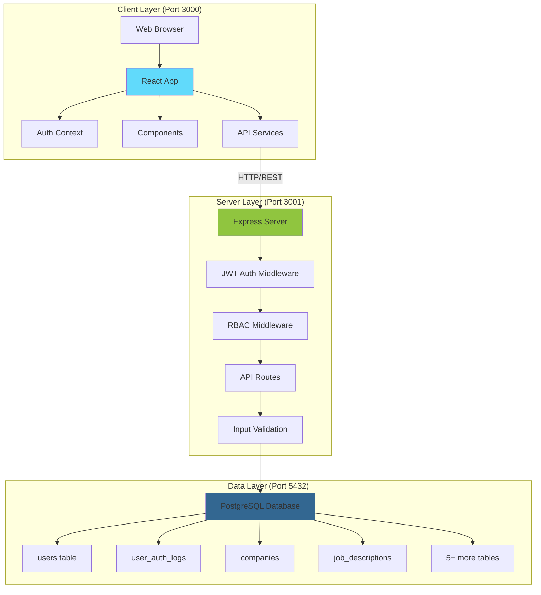
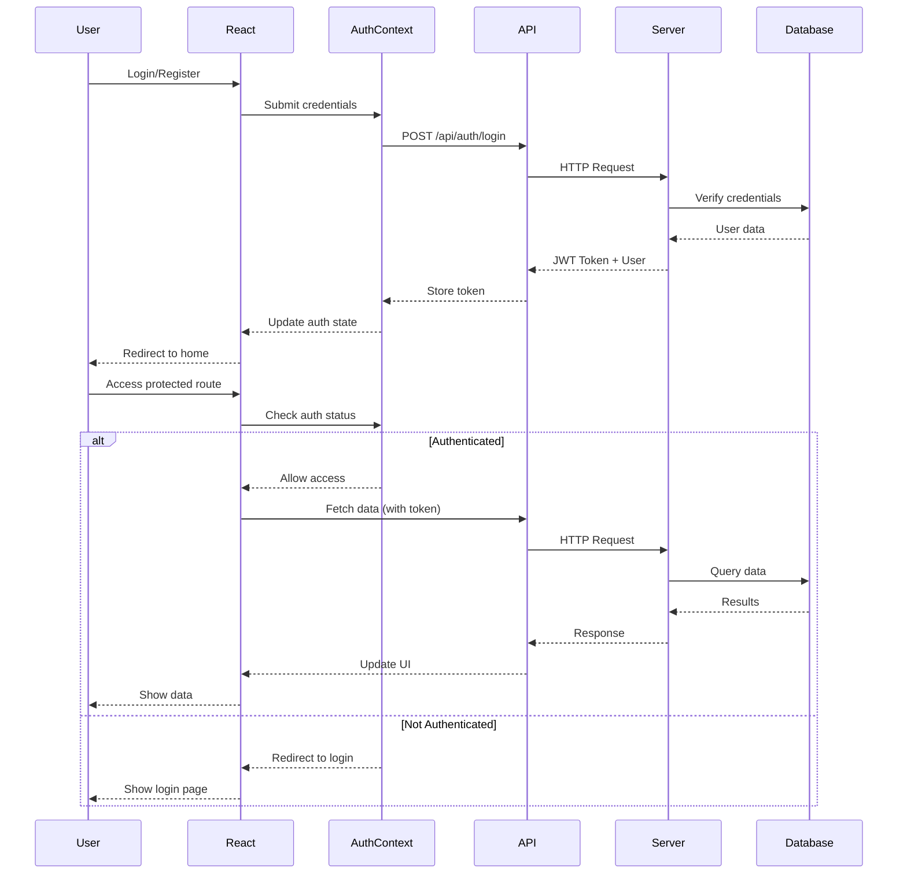
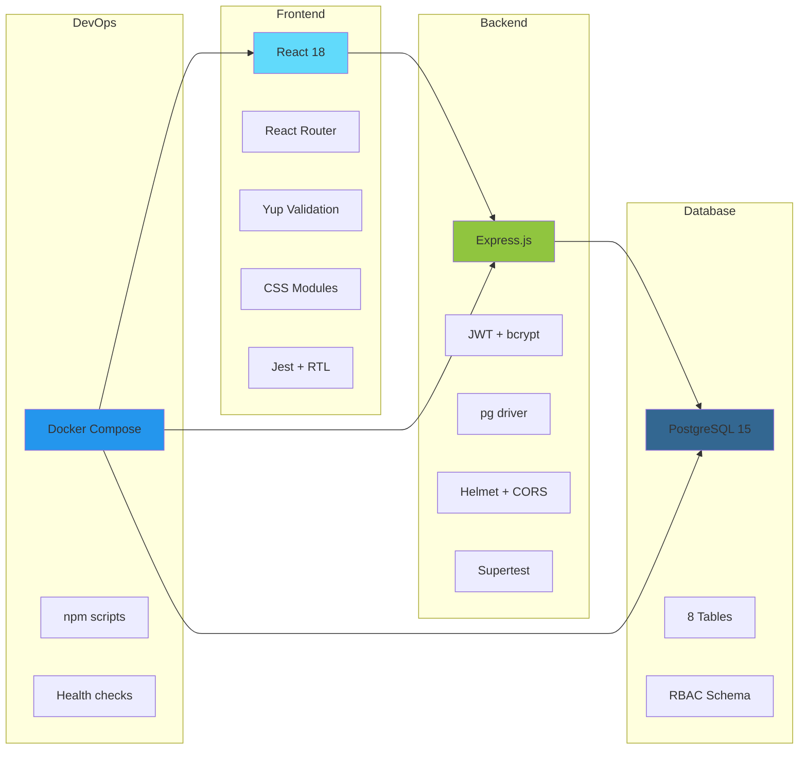

# 🎯 Features & Architecture

High-level overview of the Spexture-com features, architecture, and development roadmap.

---

## 📋 Table of Contents

1. [Architecture Overview](#-architecture-overview)
2. [Project Status](#-project-status)
3. [Completed Features](#-completed-features)
4. [In Progress](#-in-progress)
5. [Planned Features](#-planned-features)
6. [Feature Roadmap](#-feature-roadmap)

---

## 🏗️ Architecture Overview

### System Architecture

### Data Flow

### Technology Stack

---

## 📊 Project Status

### Overall Progress: 37% Complete

**Core Infrastructure**: ✅ Complete
- Backend API with PostgreSQL
- Authentication & RBAC system
- Docker containerization
- Comprehensive testing (96+ tests)

**Client Integration**: ✅ Complete (Dec 2025)
- Connected to backend API
- Authentication working
- Protected routes implemented
- Toast notifications active

**Feature Development**: 🔄 30% Complete
- Job search tracking: Planned
- Resume management: Planned
- Analytics: Planned

### Completion Breakdown

| Category | Status | Progress |
|----------|--------|----------|
| **Backend API** | ✅ Complete | 100% |
| **Database Schema** | ✅ Complete | 100% |
| **Authentication** | ✅ Complete | 100% |
| **RBAC** | ✅ Complete | 100% |
| **Client Integration** | ✅ Complete | 100% |
| **Protected Routes** | ✅ Complete | 100% |
| **Testing** | ✅ Strong | 85% |
| **Job Features** | 🔄 Basic | 15% |
| **Admin UI** | 🔄 Basic | 20% |
| **Documentation** | ✅ Excellent | 95% |

---

## ✅ Completed Features

### 1. Backend Infrastructure ✅

**Status**: ✅ Complete

**Components**:
- Express.js REST API server (Port 3001)
- PostgreSQL database (Port 5432)
- Docker Compose orchestration
- Connection pooling
- Health checks

**Files**: `server/src/index.js`, `docker-compose.yml`, `server/src/database/connection.js`

### 2. Authentication System ✅

**Status**: ✅ Complete

**Features**:
- User registration with email/password
- User login with JWT tokens
- Password hashing (bcrypt, 10 rounds)
- Token expiration (24h default)
- Token persistence (localStorage)
- Login/logout tracking

**Endpoints**:
- `POST /api/auth/register`
- `POST /api/auth/login`

**Files**: `server/src/routes/auth.js`, `server/src/middleware/auth.js`, `src/contexts/AuthContext.js`

### 3. Role-Based Access Control (RBAC) ✅

**Status**: ✅ Complete

**Roles**:
- **admin**: Full system access, user management
- **user**: Access to own data only

**Features**:
- Role-based middleware
- Elevated sessions (15-min expiry) for sensitive admin operations
- Audit logging for all admin actions
- Ownership checks (users can only access own data)

**Default Admin**: `admin@spexture-com.local` / `Admin123!`

**Files**: `server/src/middleware/rbac.js`, `server/src/routes/admin.js`

### 4. Database Schema ✅

**Status**: ✅ Complete (8 tables)

**Tables**:
1. **users** - User accounts with RBAC
2. **user_auth_logs** - Authentication audit trail
3. **companies** - Organizations offering jobs
4. **recruiters** - Recruiting contacts
5. **resumes** - Resume version tracking
6. **cover_letters** - Cover letter versions
7. **job_description_sources** - Where JDs originated
8. **job_descriptions** - Job postings with tracking

**Files**: `server/database/init.sql`, `server/database/migrations/`

### 5. Client-Backend Integration ✅

**Status**: ✅ Complete (Dec 2025)

**Implementation**:
- LoginRegister uses `authAPI.register()` and `authAPI.login()`
- Token storage via AuthContext
- Loading states during API calls
- Success/error messages with toast notifications
- Redirects after successful auth
- Form clearing after submission

**Files**: `src/components/LoginRegister.js`, `src/services/api.js`

### 6. Authentication Context ✅

**Status**: ✅ Complete

**Features**:
- User state management (isAuthenticated, user, token, loading)
- login/logout/register/updateUser methods
- Token persistence in localStorage
- Token verification on mount
- Role checking helpers: `isAdmin()`, `hasRole()`
- Elevated session management for admin operations

**Files**: `src/contexts/AuthContext.js`

### 7. Protected Routes ✅

**Status**: ✅ Complete

**Implementation**:
- `ProtectedRoute` wrapper component
- Checks authentication status from AuthContext
- Redirects to login if not authenticated
- Shows loading spinner during auth check
- 5 protected routes:
  - `/analyzer` - Job Description Analyzer
  - `/profile` - User Profile
  - `/admin` - Admin Dashboard
  - `/admin/users` - User Management
  - `/admin/testing` - Testing Coverage

**Files**: `src/components/ProtectedRoute.js`, `src/App.js`

### 8. Admin User Management API ✅

**Status**: ✅ Complete

**Endpoints**:
- `POST /api/admin/verify-password` - Get elevated session token
- `GET /api/admin/users` - List all users (filters, sorting, pagination)
- `GET /api/admin/users/:id` - Get detailed user info
- `PUT /api/admin/users/:id/role` - Change user role (requires elevated session)
- `PUT /api/admin/users/:id/password` - Reset password (requires elevated session)
- `PUT /api/admin/users/:id/status` - Activate/deactivate user (requires elevated session)
- `GET /api/admin/users/:id/activity` - Get user activity logs

**Files**: `server/src/routes/admin.js`

### 9. Form Validation ✅

**Status**: ✅ Complete

**Features**:
- Yup-based validation with centralized configuration
- Real-time feedback
- Enhanced error messages
- Client-side validation
- Server-side validation

**Files**: `src/components/LoginRegister.js`, `src/validation/`, `server/src/validation/`

### 10. Testing Infrastructure ✅

**Status**: ✅ Excellent

**Coverage**:
- 96+ tests across client and server
- 98% statement coverage (server)
- 52% statement coverage (client)
- 50% combined coverage
- Unit tests, integration tests, API tests

**Test Types**:
- Component tests (Jest + React Testing Library)
- API endpoint tests (Supertest)
- Middleware tests
- Database integration tests

**Files**: `src/__tests__/`, `server/src/__tests__/`

### 11. Error Boundaries ✅

**Status**: ✅ Complete

**Features**:
- Catches React errors
- Displays fallback UI
- Shows development error details
- Prevents app crashes

**Files**: `src/components/ErrorBoundary.js`

### 12. Toast Notifications ✅

**Status**: ✅ Complete

**Features**:
- Success/error messages for login/register
- API error handling
- User feedback for all auth actions
- Uses react-toastify library

**Files**: `src/components/LoginRegister.js`

### 13. Loading States ✅

**Status**: ✅ Complete

**Features**:
- Reusable loading spinner component
- Customizable size and messages
- Used during API calls
- Used in ProtectedRoute

**Files**: `src/components/Loading.js`

### 14. API Service Layer ✅

**Status**: ✅ Complete

**Features**:
- HTTP client with authentication token management
- Automatic token injection from localStorage
- Centralized error handling with interceptors
- Separate admin API service

**Files**: `src/services/api.js`, `src/services/adminAPI.js`

### 15. Docker Compose Setup ✅

**Status**: ✅ Complete

**Services**:
- PostgreSQL database (postgres:15-alpine)
- Express API server
- React development server
- Health checks
- Volume persistence

**Files**: `docker-compose.yml`, `Dockerfile.client`, `server/Dockerfile`

---

## 🔄 In Progress

### 16. Admin User Management UI 🔄

**Status**: 🔄 20% Complete

**Completed**:
- AdminAuthModal - Password re-authentication modal
- Admin API service methods

**Remaining**:
- AdminDashboard - Main admin page with overview
- UserManagement - List all users with filters/sorting/pagination
- UserEditModal - Edit user details (role, status, password)
- UserActivityLog - View user's activity history

**Estimated Time**: 3-4 hours

**Priority**: 🔴 High

### 17. JDAnalyzer Core Functionality 🔄

**Status**: 🔄 10% Complete

**Completed**:
- Form exists
- Route configured

**Remaining**:
- Word frequency analysis
- Keyword extraction
- JD comparison functionality
- Save/load job descriptions (connect to backend API)
- Analysis results display

**Priority**: 🟡 Medium

---

## 📋 Planned Features

### 18. Job Search Tracking

**Status**: ❌ Planned

**Features**:
- Save job descriptions
- Track application status
- Link to companies and recruiters
- Store submission details (resume, cover letter used)
- Track responses and interviews

**Priority**: 🟡 Medium

### 19. Resume & Cover Letter Management

**Status**: ❌ Planned

**Features**:
- Upload resume versions
- Track which resume used for each application
- Store cover letter templates
- Version management

**Priority**: 🟡 Medium

### 20. Interview Tracking

**Status**: ❌ Planned

**Features**:
- Schedule interviews
- Track interview rounds
- Store interview notes
- Link to job descriptions
- Track outcomes

**Priority**: 🟢 Low

### 21. Analytics & Reporting

**Status**: ❌ Planned

**Features**:
- Application success rate
- Time to response metrics
- Source effectiveness (LinkedIn vs Indeed vs Recruiter)
- Company insights
- Skill frequency analysis

**Priority**: 🟢 Low

### 22. Email Integration

**Status**: ❌ Planned

**Features**:
- Parse job description emails
- Auto-save to database
- Track email communications
- Send application reminders

**Priority**: 🟢 Low

---

## 🔒 Security Enhancements (Planned)

### 23. Input Sanitization

**Status**: ❌ Missing

**Why needed**: Prevent XSS attacks

**Priority**: 🟡 Medium

### 24. CSRF Protection

**Status**: ❌ Missing

**Why needed**: Prevent CSRF attacks

**Priority**: 🟡 Medium

### 25. Rate Limiting

**Status**: ❌ Missing

**Why needed**: Prevent brute force attacks, API abuse

**Priority**: 🟡 Medium

---

## 🎨 UX Enhancements (Planned)

### 26. Mobile Responsiveness

**Status**: ⚠️ Not tested

**Why needed**: App may not work well on mobile devices

**Priority**: 🟡 Medium

### 27. Dark Mode

**Status**: ❌ Missing

**Why needed**: User preference, better for low light

**Priority**: 🟢 Low

### 28. ARIA Labels & Accessibility

**Status**: ⚠️ Basic HTML

**Why needed**: Screen reader support, keyboard navigation

**Priority**: 🟢 Low

---

## 📈 Feature Roadmap

### Phase 1: Foundation ✅ Complete

- [x] Backend API with PostgreSQL
- [x] Authentication & RBAC
- [x] Docker setup
- [x] Client-backend integration
- [x] Protected routes
- [x] Admin API endpoints

**Target**: Q4 2024 → **Achieved**: Dec 2025

### Phase 2: Core Features 🔄 In Progress

- [x] Admin auth modal
- [ ] Admin dashboard UI
- [ ] User management UI
- [ ] JDAnalyzer functionality
- [ ] Job description CRUD
- [ ] Basic analytics

**Target**: Q1 2025 → **Status**: 30% Complete

### Phase 3: Enhanced Features 🔮 Planned

- [ ] Resume management
- [ ] Interview tracking
- [ ] Company insights
- [ ] Email integration
- [ ] Advanced analytics
- [ ] Mobile responsiveness

**Target**: Q2 2025

### Phase 4: Polish & Scale 🔮 Future

- [ ] E2E testing with Cypress
- [ ] Performance optimization
- [ ] Production deployment
- [ ] Monitoring & logging
- [ ] API rate limiting
- [ ] Advanced security features

**Target**: Q3 2025

---

## 📊 Feature Priority Matrix

### 🔴 High Priority (Next Sprint)
1. Admin Dashboard UI
2. User Management UI
3. JDAnalyzer core functionality

### 🟡 Medium Priority (Q1 2025)
1. Job description CRUD
2. Company management
3. Recruiter tracking
4. Input sanitization
5. Mobile responsiveness

### 🟢 Low Priority (Q2 2025)
1. Resume management
2. Interview tracking
3. Email integration
4. Analytics dashboard
5. Dark mode

---

## 📚 Additional Resources

### Documentation
- **Quick Start**: [`00_QUICK_START.md`](./00_QUICK_START.md)
- **Getting Started**: [`01_GETTING_STARTED.md`](./01_GETTING_STARTED.md)
- **Docker**: [`03_DOCKER.md`](./03_DOCKER.md)
- **Database**: [`04_DATABASE.md`](./04_DATABASE.md)
- **Server API**: [`05_SERVER.md`](./05_SERVER.md)
- **Client**: [`06_CLIENT.md`](./06_CLIENT.md)
- **Testing**: [`07_TESTING.md`](./07_TESTING.md)

### Status Reports
- **Project Status**: [`../PROJECT_STATUS.md`](../PROJECT_STATUS.md)
- **RBAC Implementation**: [`RBAC_IMPLEMENTATION_STATUS.md`](./RBAC_IMPLEMENTATION_STATUS.md)

---

**Last Updated**: 2025-12-07
**Next Review**: Q1 2025
**Overall Status**: 🟢 On Track
